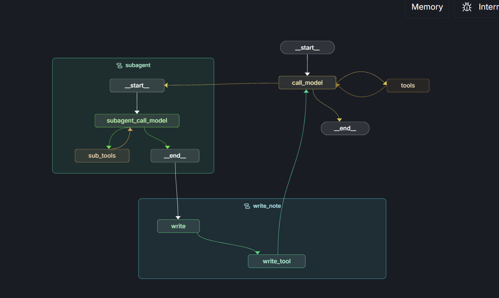

# 旅游规划助手 编写思路分享

项目基于 Langchain 官方的`deepagents`进行改写，适配国内的部分顶尖模型，采用 langgraph 构建,作用是帮助用户规划旅游安排。

下文将从 LangGraph 状态图结构和上下文处理两个方面分析。这也是编写该项目的核心思路。

## LangGraph 状态图结构

图结构，如下图所示



整体来看分为三个智能体

- `主智能体`：拆解用户需求，生成多个待办子任务，并调度子智能体执行
- `子智能体`：执行单个待办子任务，并返回结果
- `笔记智能体`：记录笔记，并返回结果

### 图的状态构建

```python
class State(MessagesState, total=False):
    todo: list[Todo]
    task_messages: Annotated[list[AnyMessage], add_messages]
    note: Annotated[dict[str, str], file_reducer]
    now_task_message_index: int
    write_note_messages: Annotated[list[AnyMessage], add_messages]
```

这是本次的状态图的字典结构。
核心的两个字段是`todo`和`note`，与官方的相同。

`todo` 字段是用于存储待办事项列表的。在官方的实现中是实现`planning tool`的核心。本实现中这个字段对应了两个核心工具。

```python

@tool
def write_todo(todos: list[str], tool_call_id: Annotated[str, InjectedToolCallId]):
    """用于写入todo的工具,只能使用一次，在最开始的时候使用，后续请使用update_todo更新。
    参数：
    todos: list[str], 待写入的todo列表，这是一个字符串列表，每个字符串都是一个todo内容content
    """

    return Command(
        update={
            "todo": [
                {"content": todo, "status": "pending" if index > 0 else "in_progress"}
                for index, todo in enumerate(todos)
            ],
            "messages": [
                ToolMessage(
                    content=f"Todo list 写入成功，下面请先执行{todos[0]}任务（无需修改状态为in_process）",
                    tool_call_id=tool_call_id,
                )
            ],
        }
    )


@tool
def update_todo(
    update_todos: list[Todo],
    tool_call_id: Annotated[str, InjectedToolCallId],
    state: Annotated[State, InjectedState],
):
    """用于更新todo的工具, 可以多次使用，每次使用都会更新todo列表。
    参数：
    update_todos: list[Todo], 更新的todo列表，这是一个字典列表,对于该字典的内容如下：
    每个字典包含两个字段：
    content: str, todo内容
    status: str, todo状态, 可选值有pending, in_progress, done，但是你传入的status的值只有可能是in_progress或者done

    更新的时候，只需要传入要更新的todo列表即可，无需传入所有的todo列表。

    注意：传入的update_todos中，status为in_progress和done的todo必须同时出现，即至少有一个status为in_progress的todo和至少有一个status为done的todo。

    例如当前的todo有：
    1. 待办1
    2. 待办2
    3. 待办3
    4. 待办4
    5. 待办5
    此时，完成了待办1，接下来需要完成待办2,则输入的todo_list应该为：
    [
        {"content":"待办1"，
            "status":"done"
        },
        {"content":"待办2"，
            "status":"in_progress"
        }
    ]

    """

    todo_list = state["todo"] if "todo" in state else []

    updated_todo_list = []

    # 遍历update_todo,每遍历一个todo，就从todo_list中查找对应的todo，并更新其状态
    for update_todo in update_todos:
        for todo in todo_list:
            if todo["content"] == update_todo["content"]:
                todo["status"] = update_todo["status"]
                updated_todo_list.append(todo)

    # 检查是否所有的todo were updated
    if len(updated_todo_list) < len(update_todos):
        raise ValueError(
            "未找到如下的todo:"
            + ",".join(
                [
                    todo["content"]
                    for todo in update_todos
                    if todo not in updated_todo_list
                ]
            )
            + "请检查todo列表是否正确，目前的todo列表为:"
            + "\n".join(
                [todo["content"] for todo in todo_list if todo["status"] != "done"]
            )
        )

    return Command(
        update={
            "todo": todo_list,
            "messages": [
                ToolMessage(content="Todo list 更新成功", tool_call_id=tool_call_id)
            ],
        }
    )
```

`write_todo`<br>
`write_todo`工具接收一个字符串列表作为参数，列表中的每个字符串代表一条待办事项的内容。在具体实现中，函数会将这些字符串转换为结构化的待办事项对象，格式为`{"content": "待办事项内容", "status": "pending"}`，并存储在状态的 todo 字段中。为了优化执行流程并减少不必要的工具调用，函数会自动将第一条待办事项的状态设置为`in_progress`，表示该任务已经开始执行。
<br>
`update_todo` <br>
工具接收一个由字典组成的列表，每个字典包含两个字段：`content`字段代表任务的内容，`status`字段代表任务的状态。`status`字段只有两个可能的取值：`done`（已完成）或`in_progress`（进行中），且在每次调用时这两种状态都必须同时出现。该函数的实现逻辑是：首先根据传入的参数更新状态中的 todo 字段，然后验证所有传入的待办事项是否都能在现有的 todo 列表中找到对应项。如果存在无法匹配的待办事项，函数会抛出异常并提示 LLM 输入的参数有误。

本实现与官方版本的主要区别在于工具设计策略。官方采用单一工具同时处理待办事项的创建和状态更新，而本项目将这两个功能拆分为 `write_todo` 和 `update_todo`两个独立工具。

这种做法的核心考虑是优化 token 使用效率。以一个包含四个任务的场景为例：[任务 1, 任务 2, 任务 3, 任务 4]。在官方的单一工具模式下，每次状态更新都需要传递完整的待办事项列表。当任务 1 完成需要开始任务 2 时，即使任务 3 和任务 4 的状态未发生变化，也必须在工具调用中重新声明，这造成了不必要的 token 消耗。

而采用`update_todo`工具的增量更新方式，只需传递实际发生变化的项目：将任务 1 标记为 `done`，将任务 2 标记为 `in_progress`，无需涉及任务 3 和任务 4，从而显著减少了 token 的浪费。

然后是`note`字段。代表的是文件系统，但是和官方的一致，这个不是真实的文件系统，而是 langgraph 状态的抽象表示。
与其相关的也有三个函数。

```python

@tool
def write_note(
    file_name: Annotated[str, "笔记的名称"],
    content: Annotated[str, "笔记的内容"],
    tool_call_id: Annotated[str, InjectedToolCallId],
):
    """用于写入笔记的工具。

    参数：
    content: str, 笔记内容

    """

    return Command(
        update={
            "note": {file_name: content},
            "write_note_messages": [
                ToolMessage(
                    content=f"笔记{file_name}写入成功，内容是{content}",
                    tool_call_id=tool_call_id,
                )
            ],
        }
    )


@tool
def ls(state: Annotated[State, InjectedState]):
    """列出笔记列表。

    返回：
    list[str], 笔记列表

    """
    notes = state["note"] if "note" in state else {}
    return list(notes.keys())


@tool
def query_note(file_name: str, state: Annotated[State, InjectedState]):
    """查询笔记。

    参数：
    file_name:笔记名称

    返回：
    str, 查询的笔记内容

    """
    notes = state["note"] if "note" in state else {}

    return notes.get(file_name, "未找到笔记名称")
```

这三个函数的实现策略与官方版本保持一致，核心设计思想是将文件系统抽象为一个简单的字典结构，其中文件名作为键（key），文件内容作为值（value）。具体的三个工具的实现这里就不多介绍非常简单。

另外还有两个核心的字段需要介绍
`task_messages` 和 `now_task_message_index`这两个字段是为子智能体提供独立上下文窗口。在具体实现中，主智能体的对话历史存储在默认的 `messages` 字段中，而 `task_messages`则专门用于管理子智能体的消息流。这样就可以实现，主智能体和子智能体之间的上下文隔离。
`now_task_message_index`字段的作用是为每个子智能体的任务执行创建独立的上下文窗口。具体来说，该字段记录了当前子智能体上下文窗口中第一条消息的索引位置，因此读取 messages 时，会从该索引位置开始读取。确保不同任务之间的消息不会相互干扰，从而保证每个子智能体都能在一个干净、专属的上下文环境中执行任务。

最后是剩余的一个字段`write_note_messages`,无特殊含义，仅用于存储笔记写入的工具调用和返回结果

## 上下文管理思路

### 上下文隔离思路

其实这一部分的思路在上文已经详细介绍了，这里略。

### KVCache

主要体现在主智能体上，主智能体核心是执行 todo list 的管理和分配任务，因此需要多轮工具调用。对于每一次产生的 AIMessage 和 ToolMessage 都放到列表的后面部分，这样不会破坏原有的 KVCache。

### 上下文共享

上下文共享的核心机制基于 `note` 字段实现。所有智能体都通过这个统一的笔记系统进行信息交换，每个智能体都配备了 `query_note`工具来按需获取先前任务的执行结果。

但在工具配置上，主智能体和子智能体采用了不同的策略：

**主智能体的工具策略**

- 拥有`ls`、`query_note` 等工具
- 主要职责是任务分解和调度，不需要完全了解所有任务的详细结果
- 避免将大量笔记内容直接拼接到提示词中，防止 KV Cache 失效

**子智能体的工具策略**

- 仅提供 `query_note`工具
- 采用"告知 + 按需查询"的模式：在系统提示词中直接列出当前可用的笔记名称，让智能体根据任务需要主动查询相关内容
- 由于每个子任务都运行在独立的上下文窗口中，即使采用直接拼接的方式也不会影响 KV Cache 的有效性

**笔记写入**
分别通过两个比较轻量的模型例如 glm4.5-air、qwen-flash、qwen3-next-80b-a3b-instruct 这些模型分别完成笔记的写入和任务结果摘要编写。
