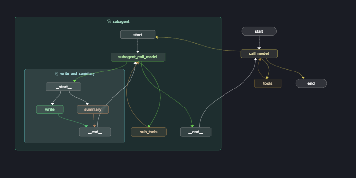

# 旅游规划助手 编写思路分享

项目基于 Langchain 官方的`deepagents`进行改写，适配国内的部分顶尖模型，采用 langgraph 构建,作用是帮助用户规划旅游安排。

下文将从 LangGraph 状态图结构和上下文处理两个方面分析。这也是编写该项目的核心思路。

## LangGraph 状态图结构

图结构，如下图所示



整体来看分为两个智能体

- `主智能体`：拆解用户需求，生成多个待办子任务，并调度子智能体执行
- `子智能体`：执行单个待办子任务，并返回结果

### 图的状态构建

```python
# 输入状态
class StateInput(MessagesState):
    pass

# 主智能体状态
class State(MessagesState, PlanStateMixin, NoteStateMixin, total=False):
    task_messages: Annotated[list[AnyMessage], add_messages]

# 子智能体状态
class SubAgentState(MessagesState, NoteStateMixin, total=False):
    temp_task_messages: Annotated[list[AnyMessage], add_messages]
```

这是本次的状态图的字典结构。
目前的实现采用了`langchain_dev_utils`中的`PlanStateMixin`和`NoteStateMixin`。
核心的两个字段是`plan`和`note`。

`plan` 字段是用于存储待办事项列表的。在官方的实现中是实现`planning tool`的核心。本项目引入了`langchain-dev-utils`中的`create_write_plan_tool`和`create_update_plan_tool`两个工具用于实现`write_plan`和`update_plan`。
`write_plan`<br>
`write_plan`工具接收一个字符串列表作为参数，列表中的每个字符串代表一条待办事项的内容。在具体实现中，函数会将这些字符串转换为结构化的待办事项对象，格式为`{"content": "待办事项内容", "status": "pending"}`，并存储在状态的 plan 字段中。为了优化执行流程并减少不必要的工具调用，函数会自动将第一条待办事项的状态设置为`in_progress`，表示该任务已经开始执行。
<br>
`update_plan` <br>
工具接收一个由字典组成的列表，每个字典包含两个字段：`content`字段代表任务的内容，`status`字段代表任务的状态。`status`字段只有两个可能的取值：`done`（已完成）或`in_progress`（进行中），且在每次调用时这两种状态都必须同时出现。该函数的实现逻辑是：首先根据传入的参数更新状态中的 plan 字段，然后验证所有传入的待办事项是否都能在现有的 plan 列表中找到对应项。如果存在无法匹配的待办事项，函数会抛出异常并提示 LLM 输入的参数有误。

本实现与官方版本的主要区别在于工具设计策略。官方采用单一工具同时处理待办事项的创建和状态更新，而本项目将这两个功能拆分为 `write_plan` 和 `update_plan`两个独立工具。

这种做法的核心考虑是优化 token 使用效率。以一个包含四个任务的场景为例：[任务 1, 任务 2, 任务 3, 任务 4]。在官方的单一工具模式下，每次状态更新都需要传递完整的待办事项列表。当任务 1 完成需要开始任务 2 时，即使任务 3 和任务 4 的状态未发生变化，也必须在工具调用中重新声明，这造成了不必要的 token 消耗。

而采用`update_plan`工具的增量更新方式，只需传递实际发生变化的项目：将任务 1 标记为 `done`，将任务 2 标记为 `in_progress`，无需涉及任务 3 和任务 4，从而显著减少了 token 的浪费。

然后是`note`字段。代表的是文件系统，但是和官方的一致，这个不是真实的文件系统，而是 langgraph 状态的抽象表示。
与其相关的也有三个函数。
同样这三个核心工具`write_note`、`ls`、`query_note`采用了`langchain_dev_utils`中的`create_write_note_tool`、`create_ls_tool`、`create_query_note_tool`。

这三个函数的实现策略与官方版本保持一致，核心设计思想是将文件系统抽象为一个简单的字典结构，其中文件名作为键（key），文件内容作为值（value）。具体的三个工具的实现这里就不多介绍非常简单。

另外还有两个核心字段需要介绍 分别是`task_messages`和`temp_task_messages`。
`task_messages`是存储子智能体的所有的对话历史，`temp_task_messages`是临时的用于子智能体执行的上下文窗口。

## 上下文管理思路

### 上下文隔离思路

**状态隔离**

- 主智能体使用
  message 字段存储主智能体的消息列表
- 子智能体使用
  task_messages 字段存储所有的子智能体的全部完整的消息列表。
  temp_task_messages 作为临时执行上下文窗口
- 两个消息队列完全独立，避免了上下文污染

**执行流程隔离**

- 子智能体每次执行都会创建全新的 temp_task_messages 上下文窗口
- 执行完成后，只有关键信息通过摘要形式传递回主智能体
- 这种设计确保了子任务之间的完全隔离，每个子任务都在干净的环境中执行

**LangGraph 子图实现**

- 通过 [`build_sub_agent()`](src/agent/sub_agent/graph.py:8) 创建独立的子图结构
- 子图有自己的状态管理和节点流转逻辑
- 主图通过 [`transfor_task_to_subagent`](src/agent/tools.py:102) 工具将任务委派给子图执行

### KVCache 优化策略

主要体现在主智能体上，主智能体核心是执行 todo list 的管理和分配任务，因此需要多轮工具调用。对于每一次产生的 AIMessage 和 ToolMessage 都放到列表的后面部分，这样不会破坏原有的 KVCache。

### 基于 Note 的上下文共享机制

上下文共享的核心机制基于 `note` 字段实现。`note` 作为全局共享的"知识库"，实现了智能体间的高效信息传递：

**笔记管理**

- `note` 字段本质上是一个抽象文件系统，以字典形式存储在 LangGraph 状态中
- 通过 `write_note` 工具，子智能体将执行结果持久化为"文件"
- 通过 `query_note` 工具，任何智能体可以按需查询历史结果

**差异化工具配置策略**

**主智能体的工具策略**

- 拥有完整的工具集：`ls`、`query_note` 等
- 采用按需查询原则，只在确切需要了解完整的子任务结果的时候才调用 `query_note`（根据运行结果来看，基本上不调用）
- 主要职责是任务分解和调度，避免加载大量笔记内容破坏 KV Cache

**子智能体的工具策略**

- 仅提供 `query_note` 工具用于查询历史依赖
- 在系统提示词中直接列出可用笔记名称，实现"告知 + 按需查询"模式
- 由于每个子任务运行在独立的上下文窗口中，直接拼接历史笔记不会影响 KV Cache

**智能查询机制**

- 子智能体的 `SUBAGENT_PROMPT` 中包含 `{history_files}` 变量
- 系统自动将当前可用笔记名称注入提示词，帮助子智能体识别潜在依赖
- 子智能体根据任务性质自主决定是否查询历史笔记

**任务总结与信息传递**
利用轻量化的模型例如 glm4.5-air、qwen-flash、qwen3-next-80b-a3b-instruct 这些模型实现任务总结的，这个摘要是返回给主智能体的，主智能体根据这个摘要决定是否需要更新 plan。
